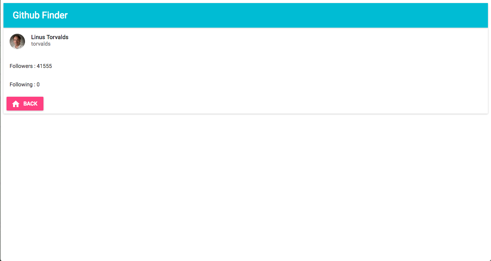

# 用 React + Router + Redux + ImmutableJS 寫一個 Github 查詢應用

## 前言
學了一身本領後，本章將帶大家完成一個單頁式應用程式（Single Page Application），運用 React + Redux + ImmutableJS + React Router 搭配 Github API 製作一個簡單的 Github 使用者查詢應用。

## 功能規劃
讓訪客可以使用 Github Id 搜尋 Github 使用者，展示 Github 使用者名稱、follower、following、avatar_url 並可以返回首頁。

## 使用技術

1. React
2. Redux
3. Redux Thunk
4. React Router
5. ImmutableJS
6. Fetch
7. [Material UI](http://www.material-ui.com/#/)
8. Weather API Icons
9. Roboto Font from Google Font
10. Github API（https://api.github.com/users/torvalds）

## 專案成果截圖




## 動手實作

1. 環境安裝與設定
	- 安裝 Node 和 NPM

	- 安裝所需套件

	```
	$ npm install --save react react-dom redux react-redux react-router immutable redux-immutable redux-actions whatwg-fetch redux-thunk material-ui react-tap-event-plugin
	```

	```
	$ npm install --save-dev babel-core babel-eslint babel-loader babel-preset-es2015 babel-preset-react babel-preset-stage-1 eslint eslint-config-airbnb eslint-loader eslint-plugin-import eslint-plugin-jsx-a11y eslint-plugin-react html-webpack-plugin webpack webpack-dev-server redux-logger
	```

2. Setup Mockup

3. Build Component

4. Actions/Reducers

5. Fetch API/Data Processing

6. Connect State to Component

7. That's it

## 延伸閱讀

1. [Tutorial: build a weather app with React](http://joanmira.com/tutorial-build-a-weather-app-with-react/)
2. [OpenWeatherMap](http://openweathermap.org/)
3. [Weather Icons](https://erikflowers.github.io/weather-icons/)
4. [Weather API Icons](https://erikflowers.github.io/weather-icons/api-list.html)
5. [Material UI](http://www.material-ui.com/#/)
6. [【翻译】这个API很“迷人”——(新的Fetch API)](http://www.w3ctech.com/topic/854)
7. [Redux: trigger async data fetch on React view event](http://stackoverflow.com/questions/33304225/redux-trigger-async-data-fetch-on-react-view-event)
8. [Github API](https://api.github.com/)