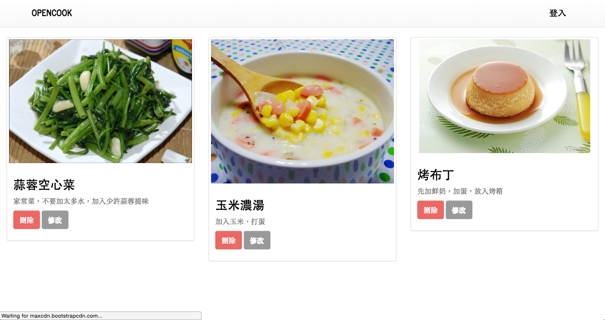

# 用 React + Redux + Node（Isomorphic）開發一個食譜分享網站

## 需求規劃
讓使用者可以登入會員並分享食譜的社群網站

## 功能規劃
1. React Router / Redux / Immutable / Server Render / Async API
2. 使用者登入/登出（JSON Web Token）
3. CRUD 表單資料處理
4. 資料庫串接(ORM/MongoDB)

## 使用技術
1. React
2. Redux(redux-actions/redux-promise/redux-immutable)
3. React Router
4. ImmutableJS
5. Node MongoDB ORM(Mongoose)
6. JSON Web Token
7. React Bootstrap
8. Axios(Promise)
9. Webpack
10. UUID

## 專案成果截圖




## 環境安裝與設定
1. 安裝 Node 和 NPM

2. 安裝所需套件

```
$ npm install --save react react-dom redux react-redux react-router immutable redux-immutable redux-actions redux-promise bcrypt body-parser cookie-parser debug express immutable jsonwebtoken mongoose morgan passport passport-local react-router-bootstrap axios serve-favicon validator uuid
```

```
$ npm install --save-dev babel-core babel-eslint babel-loader babel-preset-es2015 babel-preset-react babel-preset-stage-1 eslint eslint-config-airbnb eslint-loader eslint-plugin-import eslint-plugin-jsx-a11y eslint-plugin-react html-webpack-plugin webpack webpack-dev-server redux-logger
```

接下來我們先設定一下開發文檔。

1. 設定 Babel 的設定檔： `.babelrc`

	```javascript
	{
		"presets": [
	  	"es2015",
	  	"react",
	 	],
		"plugins": []
	}

	```

2. 設定 ESLint 的設定檔和規則： `.eslintrc`

	```javascript
	{
	  "extends": "airbnb",
	  "rules": {
	    "react/jsx-filename-extension": [1, { "extensions": [".js", ".jsx"] }],
	  },
	  "env" :{
	    "browser": true,
	  }
	}
	```

3. 設定 Webpack 設定檔： `webpack.config.js`

	```javascript
	// 讓你可以動態插入 bundle 好的 .js 檔到 .index.html
	const HtmlWebpackPlugin = require('html-webpack-plugin');

	const HTMLWebpackPluginConfig = new HtmlWebpackPlugin({
	  template: `${__dirname}/src/index.html`,
	  filename: 'index.html',
	  inject: 'body',
	});
	
	// entry 為進入點，output 為進行完 eslint、babel loader 轉譯後的檔案位置
	module.exports = {
	  entry: [
	    './src/index.js',
	  ],
	  output: {
	    path: `${__dirname}/dist`,
	    filename: 'index_bundle.js',
	  },
	  module: {
	    preLoaders: [
	      {
	        test: /\.jsx$|\.js$/,
	        loader: 'eslint-loader',
	        include: `${__dirname}/src`,
	        exclude: /bundle\.js$/
	      }
	    ],
	    loaders: [{
	      test: /\.js$/,
	      exclude: /node_modules/,
	      loader: 'babel-loader',
	      query: {
	        presets: ['es2015', 'react'],
	      },
	    }],
	  },
	  // 啟動開發測試用 server 設定（不能用在 production）
	  devServer: {
	    inline: true,
	    port: 8008,
	  },
	  plugins: [HTMLWebpackPluginConfig],
	};
	```

太好了！這樣我們就完成了開發環境的設定可以開始動手實作我們的食譜分享社群應用程式了！	

## 動手實作

## 延伸閱讀
1. [joshgeller/react-redux-jwt-auth-example](https://github.com/joshgeller/react-redux-jwt-auth-example)
2. [Securing React Redux Apps With JWT Tokens](https://medium.com/@rajaraodv/securing-react-redux-apps-with-jwt-tokens-fcfe81356ea0#.5hfri5j5m)
3. [Adding Authentication to Your React Native App Using JSON Web Tokens](https://auth0.com/blog/adding-authentication-to-react-native-using-jwt/)
4. [Authentication in React Applications, Part 2: JSON Web Token (JWT)](http://vladimirponomarev.com/blog/authentication-in-react-apps-jwt)
5. [Node.js 身份認證：Passport 入門](https://nodejust.com/nodejs-passport-auth-tutorial/)
6. [react-bootstrap compatibility #83](https://github.com/reactjs/react-router/issues/83)
7. [How to authenticate routes using Passport? #725](https://github.com/reactjs/react-router/issues/725)
8. [Isomorphic React Web App Demo with Material UI](https://github.com/tech-dojo/react-showcase)
9. [react-router/examples/auth-flow/](https://github.com/reactjs/react-router/tree/master/examples/auth-flow)
10. [redux-promise](https://github.com/acdlite/redux-promise)
11. [How to use redux-promise](http://qiita.com/takaki@github/items/42bddf01d36dc18bdc8e)
12. [Authenticate a Node.js API with JSON Web Tokens](https://scotch.io/tutorials/authenticate-a-node-js-api-with-json-web-tokens)
13. [3 JavaScript ORMs You Might Not Know](https://www.sitepoint.com/3-javascript-orms-you-might-not-know/)
14. [lynndylanhurley/redux-auth](https://github.com/lynndylanhurley/redux-auth)
15. [How to avoid getting error 'localStorage is not defined' on server in ReactJS isomorphic app?](http://stackoverflow.com/questions/33724396/how-to-avoid-getting-error-localstorage-is-not-defined-on-server-in-reactjs-is)
16. [Where to Store your JWTs – Cookies vs HTML5 Web Storage](https://stormpath.com/blog/where-to-store-your-jwts-cookies-vs-html5-web-storage)
17. [What is the difference between server side cookie and client side cookie? [closed]](http://stackoverflow.com/questions/6922145/what-is-the-difference-between-server-side-cookie-and-client-side-cookie)
18. [Cookies vs Tokens. Getting auth right with Angular.JS](https://auth0.com/blog/angularjs-authentication-with-cookies-vs-token/)
19. [Cookies vs Tokens: The Definitive Guide](https://auth0.com/blog/cookies-vs-tokens-definitive-guide/)
20. [joshgeller/react-redux-jwt-auth-example](https://github.com/joshgeller/react-redux-jwt-auth-example)
21. [Programmatically navigate using react router](http://stackoverflow.com/questions/31079081/programmatically-navigate-using-react-router)
22. [withRouter HoC (higher-order component) v2.4.0 Upgrade Guide](https://github.com/reactjs/react-router/blob/master/upgrade-guides/v2.4.0.md)

## License
MIT, Special thanks [Loading.io](http://loading.io/)
